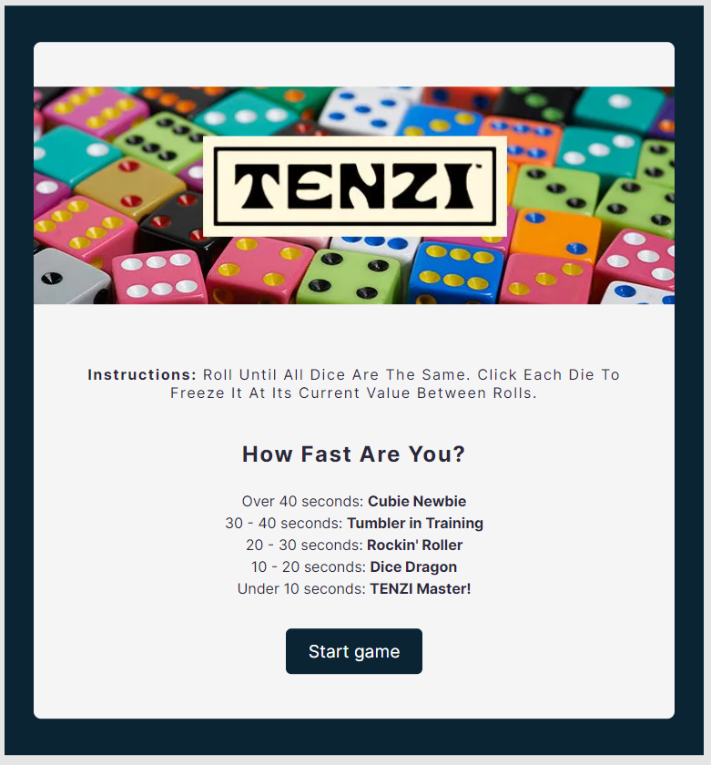

# Tenzi game

## Table of contents

- [Overview](#overview)
  - [The assignment](#the-assignment)
  - [Screenshot](#screenshot)
  - [Links](#links)
- [My process](#my-process)
  - [Built with](#built-with)
  - [Useful resources](#useful-resources)
- [Author](#author)

## Overview

### The assignment

Users should be able to:

- View the optimal layout for each of the website's pages depending on their device's screen size
- Play the game and see the score

### Screenshot

### Links

- Live Site URL: [Live](https://complete-tenzi-game-react.netlify.app/)
- GitHub repository: [Remote repository](https://github.com/JelenaAndelic/tenzi-game/tree/master)

## My process

### Built with

- Semantic HTML5 markup
- CSS custom properties
- Flexbox
- CSS Grid
- Mobile-first workflow
- React.js

### Useful resources

- [Using CSS custom properties (variables)](https://developer.mozilla.org/en-US/docs/Web/CSS/Using_CSS_custom_properties)
- [A Modern CSS Reset](https://piccalil.li/blog/a-modern-css-reset/)
- [CSS Grid Layout Module](https://www.w3schools.com/css/css_grid.asp)
- [React Documentation](https://react.dev/learn)

## Author

- Linkedin - [@JelenaTakac](https://www.linkedin.com/in/jelena-taka%C4%8D-b94446220/)
- GitHub - [@JelenaTakac](https://github.com/JelenaTakac)
